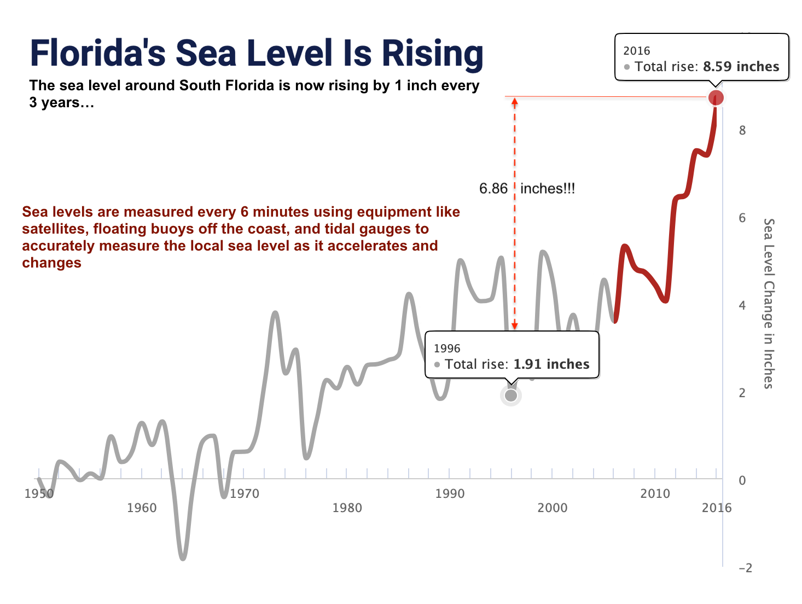
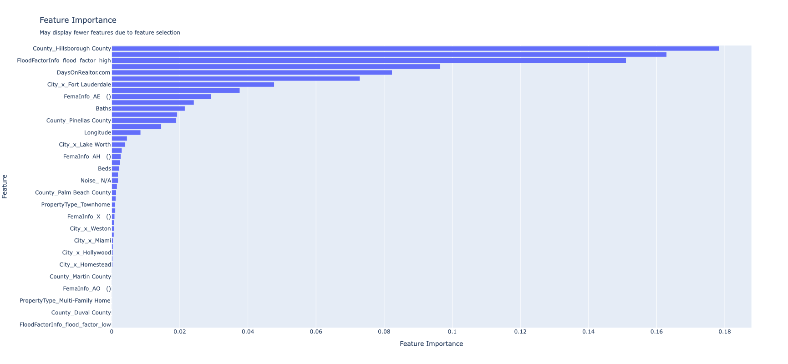

colorframe-blogs
==============================

A repo for blog article [ColorFrames: A Novel Machine Learning Approach to Assess Florida's Climate-Driven Real Estate Risk](https://medium.com/p/60e9a8913b85)

For the blog article ColorFrames: A Novel Machine Learning Approach to Assess Florida's Climate-Driven Real Estate Risk. we will be using a new data set scraped from Realtor.com.

This dataset includes records of over 1600 south Florida real estate properties, and includes flood risk information, demographic information, listing images, listing descriptions, how long the property has been listed, sales history, and lots of other related information.
The target we want to predict is the difference in the rate of property value change (regression) vs the rate of change of similar properties nearby.
In the dataset, approximately 66% of properties have a low flood risk (less than 5 on the Flood Factor scoring scale), and approx. 33% have a high flood risk.
We will test the hypothesis that a high flood risk score is a strong predictor for the difference in the rate of property value change by building an ML model, and then applying various model explainability tools to it.

**Load the Demographic Data**
Geocodio provides a few data sets we can easily append to our property data, for additional studies and usage:

* **The US Census Bureau** 
* **OpenStreetMap** 
* **GeoNames** 
* **CanVecPlus by Natural Resources Canada** 
* **StatCan** 
* **Legislator information from the UnitedStates project on GitHub** own.

Project Organization
------------

    ├── LICENSE
    ├── Makefile           <- Makefile with commands like `make data` or `make train`
    ├── README.md          <- The top-level README for developers using this project.
    ├── data
    │   ├── external       <- Data from third party sources.
    │   ├── interim        <- Intermediate data that has been transformed.
    │   ├── processed      <- The final, canonical data sets for modeling.
    │   └── raw            <- The original, immutable data dump.
    │
    ├── docs               <- A default Sphinx project; see sphinx-doc.org for details
    │
    ├── models             <- Trained and serialized models, model predictions, or model summaries
    │
    ├── notebooks          <- Jupyter notebooks. Naming convention is a number (for ordering),
    │                         the creator's initials, and a short `-` delimited description, e.g.
    │                         `1.0-jqp-initial-data-exploration`.
    │
    ├── references         <- Data dictionaries, manuals, and all other explanatory materials.
    │
    ├── reports            <- Generated analysis as HTML, PDF, LaTeX, etc.
    │   └── figures        <- Generated graphics and figures to be used in reporting
    │
    ├── requirements.txt   <- The requirements file for reproducing the analysis environment, e.g.
    │                         generated with `pip freeze > requirements.txt`
    │
    ├── setup.py           <- makes project pip installable (pip install -e .) so src can be imported
    ├── src                <- Source code for use in this project.
    │   ├── __init__.py    <- Makes src a Python module
    │   │
    │   ├── data           <- Scripts to download or generate data
    │   │   └── make_dataset.py
    │   │
    │   ├── features       <- Scripts to turn raw data into features for modeling
    │   │   └── build_features.py
    │   │
    │   ├── models         <- Scripts to train models and then use trained models to make
    │   │   │                 predictions
    │   │   ├── predict_model.py
    │   │   └── train_model.py
    │   │
    │   └── visualization  <- Scripts to create exploratory and results oriented visualizations
    │       └── visualize.py
    │
    └── tox.ini            <- tox file with settings for running tox; see tox.readthedocs.io

--------

<small>Project based on the <a target="_blank" href="https://drivendata.github.io/cookiecutter-data-science/">cookiecutter data science project template</a>. #cookiecutterdatascience</small>

